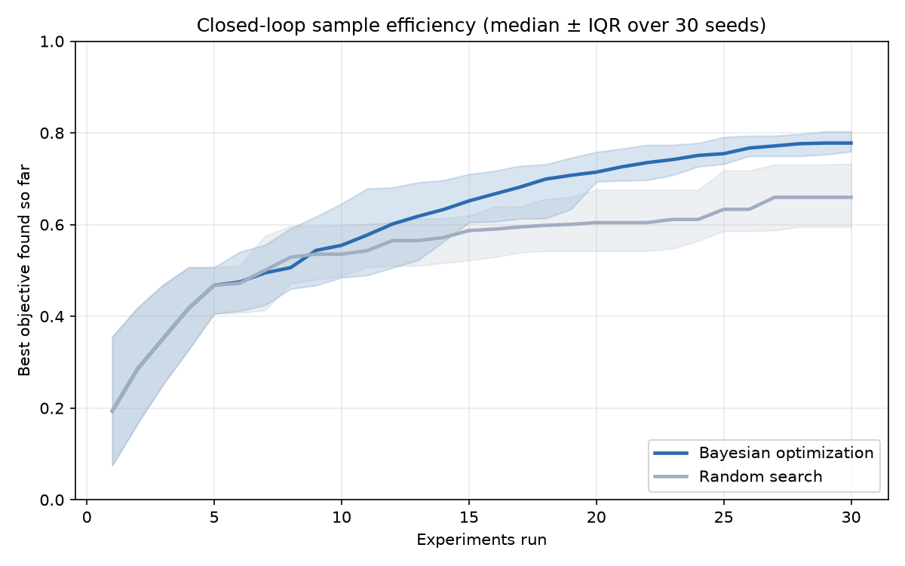

# AI to Lab Orchestrator for Materials Discovery

A working prototype of the operating layer for a self driving materials lab.

**Based on:** Sanna et al., “Search for thermodynamically stable ambient pressure superconducting hydrides in the GNoME database,” *Communications Physics*, 2026.
https://www.nature.com/articles/s42005-026-02552-4

This paper screens the GNoME database for thermodynamically stable ambient pressure superconducting hydrides. It turns a very large AI generated materials space into a smaller candidate set for further consideration.

The next bottleneck is validation workflow: what to test first, how to run the experiment, how to log the result, and how to use that result to update the next decision.

This repository explores that operating layer through two use cases: hydride candidate triage over published superconductivity data and closed loop CdTe process optimization.

## Research to Product Framing

This project starts from a practical shift in materials discovery: once AI systems can generate or screen materials at large scale, the product problem moves downstream.

The core question becomes:

**How do we turn computational candidates into prioritized, executable, and auditable lab workflows?**

This prototype focuses on four parts of that workflow:

1. Candidate prioritization
2. Experiment execution
3. Result logging and feedback
4. Transparent decision support

It is not a materials simulator. It is an orchestration and decision support layer for making AI screened materials candidates more actionable in a lab setting.

## Scope and Data Sources

This is an orchestration and decision support prototype, not a materials simulator.

### Hydride Candidate Triage

The **Hydride** use case is built directly on the paper above. It uses the published Tc, lambda, and omega_log values for 25 candidate hydrides as the basis for ranking and validation planning.

The system does not simulate those values. It adds decision policies, trade off analysis, and validation planning on top of the published data.

### CdTe Closed Loop Optimization

The **CdTe** use case runs on a literature inspired surrogate environment. It includes observation noise, a non smooth process window, an over treatment cliff, substrate temperature dependence, and experiment failures.

The surrogate is designed to benchmark closed loop optimization under realistic difficulty. It is not calibrated to commercial CdTe module efficiency and is not intended to predict PCE.

The judgment on display is knowing where real published data is required and where a surrogate is appropriate for controlled benchmarking.

## Two Use Cases

|       | Hydrides                             | CdTe                                            |
| ----- | ------------------------------------ | ----------------------------------------------- |
| Type  | Decision support triage              | Closed loop process optimization                |
| Data  | Published research data              | Literature inspired surrogate                   |
| Shows | Transparent, data grounded decisions | Closed loop execution and rigorous benchmarking |

## Use Case 1: Hydride Candidate Triage

This use case ranks 25 published hydride superconductors for experimental validation.

Ranking weights are **decision policies, not fixed constants**. Under a `max_tc` policy, the highest Tc material, LiZrH6Ru at 23.5 K, ranks first. Under a `lab_feasible_first` policy, it drops out of the top 5, reflecting the paper’s insight that extreme Tc can correlate with thermodynamic instability.

Every Tc, lambda, and omega_log value is taken directly from the paper. The system adds ranking, trade off analysis, and a data grounded validation plan on top.

## Use Case 2: CdTe Closed Loop Optimization

An optimizer proposes process parameters. A pipeline of virtual instruments runs the experiment with noise and possible failure. The score feeds back into the optimizer. The loop repeats under a fixed experiment budget.

Bayesian optimization is benchmarked against random search across 30 seeds under a fixed experiment budget, reporting **median + IQR across seeds**, since single runs vary widely. BO reaches a median best of about 0.78, near the surrogate optimum, versus about 0.66 for random search, with a tighter spread. The result is higher and more reliable.



## How to Run

```bash id="olmxyp"
python3 -m venv .venv
source .venv/bin/activate
pip install -r requirements.txt

# Hydrides: triage and validation plans
python3 run_triage.py

# CdTe: one closed loop run
python3 run_loop.py

# CdTe: BO vs random benchmark across 30 seeds
python3 benchmark.py

# CdTe: generate the convergence chart
python3 plot_benchmark.py
```

## Architecture

```text id="6mhizf"
triage      -> hydride decision support over real published data
landscape   -> the surrogate truth for the CdTe use case
devices     -> virtual instruments that measure truth, add noise, and can fail
executor    -> runs devices in order, threads data downstream, and stops on failure
optimizer   -> pluggable interface with random search and GP Expected Improvement BO
run_loop    -> the closed loop
benchmark   -> many seed median + IQR comparison
```

## Notable Engineering Decisions

See `docs/decision_log.md` for the real trade offs made while building this project, including diagnosing a GP convergence failure caused by unnormalized parameter scales, fixing a Bayesian optimizer that got stuck in experiment failure regions, and finding that single run results vary widely, which led to seed based benchmarking.

These decisions are included because the project is meant to show not only the final prototype, but also the engineering judgment behind making a research inspired workflow reliable enough to evaluate.

## Why This Project

As AI expands the materials candidate space, the scarce resource becomes validation capacity. This prototype focuses on the workflow layer that helps decide what to test, execute experiments reproducibly, capture results, and feed evidence back into the next decision.