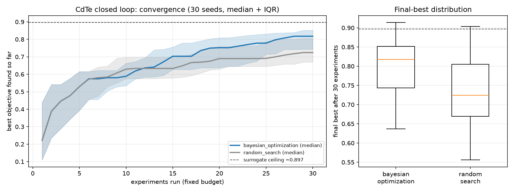

# AI-to-Lab Orchestrator for Materials Discovery

A focused self-driving-lab prototype: it turns an AI/optimizer's *next-experiment*
suggestion into an executable workflow, runs it on virtual lab devices, captures
structured + provenance-rich data, handles failures and safety review, and feeds
clean results back to close the loop.

> This repo is a **systems / orchestration** portfolio, not a physics simulator.
> See "Scientific modeling scope" below.

---

## Status: Phase 1 complete + benchmark hardened

The full closed loop runs end-to-end:

```
YAML workflow → safety gate → executor → noisy CdTe surrogate devices
            → SQLite logging → optimizer feedback → next experiment → repeat
```

### Setup

```bash
python3 -m venv .venv && ./.venv/bin/pip install -r requirements.txt
```

### Run one closed loop

```bash
./.venv/bin/python run_cdte_demo.py --method bayesian_optimization --budget 30 --seed 0
```

Every experiment (parameters, per-step outputs, artifacts, failures, safety
review, data-quality, model-feedback eligibility) is persisted to `db/lab.sqlite`.

### Reproduce the benchmark

```bash
./.venv/bin/python scripts/run_cdte_benchmark.py --seeds 30 --budget 30
./.venv/bin/python -m pytest tests/ -q          # 20 tests
```

---

## Benchmark results

**Every number below is produced by `scripts/run_cdte_benchmark.py`** and written
to `artifacts/benchmark_results/`. Nothing here is hand-entered.

30 seeds × 30-experiment budget:

| Method | Median best @ 30 exp | IQR | Failure rate | Blocked by gate | Valid feedback |
|---|---:|---|---:|---:|---:|
| Bayesian optimization | **0.818** | [0.723, 0.855] | 11% | 4% | 85% |
| Random search | **0.724** | [0.663, 0.806] | 12% | 7% | 81% |

Paired per-seed: BO beat random on **20/30 seeds**, median gap **+0.093**.



**How to read this honestly** — three things I want a reviewer to notice:

1. **The IQR bands overlap.** BO wins in the median and wins most seeds, but it
   does not dominate. On a 5-dimensional landscape with a 30-experiment budget
   that is the expected result, and a chart showing clean separation would be a
   sign the benchmark was too easy.
2. **BO does not pull ahead until roughly experiment 10.** Before that it is
   running its initial design, so it is *behind* random early. The advantage is
   sample efficiency later in the budget, not from the first experiment.
3. **A few runs exceed the 0.897 ceiling line.** That is not a bug. The dashed
   line is the maximum of the noise-free landscape; the reported score is a
   *noisy observation*, so "best found so far" is an optimistically biased
   estimator — taking a max over noisy draws is luck-prone by construction. Any
   self-driving lab that ranks candidates by single-shot best-observed has this
   bias, which is why replication matters before believing a champion.

---

## Decision policies: the weights are configurable, not constants

The objective is not baked into a simulated instrument. `ScoringEngine` collapses
measurements into one number using a **weighted policy** loaded from
`configs/policies/`, because "how much is phase purity worth relative to
efficiency?" is a research-strategy question, not a property of an XRD machine.

```bash
./.venv/bin/python run_cdte_demo.py --policy configs/policies/cdte_manufacturability_first.yaml
```

Same closed loop, same surrogate, same BO — 30 seeds, only the policy differs:

| Policy | Median best | Median treatment time found | Median dopant |
|---|---:|---:|---:|
| Performance first | 0.773 | 35.9 min | 1.2 % |
| Balanced device quality *(default)* | 0.818 | 40.0 min | 1.3 % |
| Manufacturability first | 0.926 | **27.7 min** | **0.9 %** |

**The headline scores are not comparable across rows** — each policy defines a
different objective, so a higher number does not mean a better process. That is
the point, and stating it is part of the demo. The comparable quantity is the
*operating point*: manufacturability-first converges on a treatment ~12 minutes
shorter and lighter doping, i.e. a visibly more conservative process that sits
further from the over-treatment interaction penalty. Treatment temperature lands
near 388 °C under every policy, because that window dominates the landscape —
policy influences the parameters the objective leaves room to argue about.

Every experiment records which policy scored it (`experiments.policy_id`), and
the per-term contributions are kept in the step metadata, so any score can be
decomposed into *why*. The same `WeightedPolicy` mechanism is what Phase 3's
hydride triage will use, so both halves of the system make trade-offs the same
auditable way.

---

## Architecture (4 layers)

1. **Orchestration** — `orchestrator/`: YAML parser, safety gate, executor.
2. **Data** — `db/`: SQLite store (experiments / steps / artifacts).
3. **Decision** — `optimizer/`: transparent GP + Expected-Improvement BO, random
   baseline, soft failure-avoidance + an escape hatch for infeasible regions.
   `policy/`: configurable weighted objectives, shared with hydride triage.
4. **Devices** — `devices/cdte/`: surrogate landscape + 6 virtual instruments.

Full design rationale, including the trade-offs I chose *against*, is in
[docs/architecture.md](docs/architecture.md).

The CdTe surrogate (`devices/cdte/landscape.py`) intentionally includes real
experimental messiness: a **narrow non-smooth CdCl₂ treatment window**, an
**over-treatment cliff**, **parameter interactions**, **observation noise**, and
**outright failures** (degraded samples, un-crystallized films). This is what
makes the optimizer comparison credible.

---

## Notable engineering details (interview material)

**BO getting trapped in failure regions.** Failed experiments yield no objective
value, so a naive GP never learns to avoid them and keeps re-proposing into the
dead zone. Fixed with (1) a soft feasibility penalty that down-weights
candidates near known failures, and (2) an escape hatch that forces exploration
after a streak of failures. This mirrors a real constrained-optimization problem
in autonomous labs.

**The safety gate has to be able to say no.** The gate's hazard rules are set
*wider* than the surrogate's true degradation region (blocks at 440 °C/40 min;
samples actually degrade at 450 °C/45 min), because a real lab does not know
exactly where the cliff is. This costs the optimizer reachable search space —
governance is not free, and the benchmark reports `blocked` separately from
`failed` so that cost is visible. A blocked experiment runs **zero** devices:
a failure burns a sample, a block prevents one from being burned.
`tests/test_safety_gate.py` asserts no degrading parameter set can slip past.

**A 1e-4 rounding change moved the benchmark median by 0.006.** While extracting
the scoring weights into a policy object I briefly rounded each weighted term to
6 decimal places before summing. Numerically irrelevant — but it changed which
point the GP held as incumbent, which changed the argmax of Expected
Improvement, and sent the entire search down a different path. Fixed by never
rounding before a decision (`tests/test_scoring_policy.py` guards it). The
lesson I'd carry into a real lab: closed-loop systems have chaotic sensitivity
to their own numerics, so differences below ~0.01 in these curves should not be
treated as real, and any "champion" condition needs replication before belief.

**Fair randomness between methods.** The lab's measurement noise and the
optimizer's proposals draw from **separate** streams spawned from one seed, and
the lab stream is re-derived per experiment index so both methods meet the same
noise draws at equal budget (common random numbers). Sharing one generator —
where BO's ~512 candidate draws per iteration advance the stream far faster than
random search's 5 — would make per-seed comparison meaningless.

---

## Scientific modeling scope

This project is **not** a physically accurate simulator of CdTe solar cells.
The CdTe module is a literature-*inspired* noisy surrogate **benchmark
environment** used to test orchestration, metadata capture, failure handling,
and closed-loop optimization. It makes no claim about true PCE prediction.

(Phase 3 will add hydride candidate triage driven by **published** computational
data — explicitly no fake DFPT/Tc simulation.)

---

## Roadmap

- [x] **Phase 1** — closed loop: YAML → executor → surrogate → SQLite → BO
- [x] **Phase 2** — robust benchmark: 30 seeds, BO vs random, median/IQR curves,
      failure-aware metrics, reproducible from a script
- [x] **Phase 2.5** — decision policies extracted from code into `configs/policies/`
- [ ] **Phase 3** — hydride triage from published paper data (reusing `policy/`)
- [ ] **Phase 4** — governance: hypothesis registry, data-quality view, failure taxonomy
- [ ] **Phase 5** — dashboard, deck, demo video; optional LLM-to-YAML
